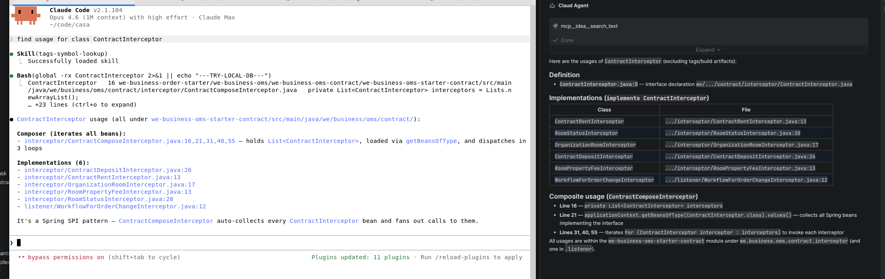

# claude-code-public-skill

Public Claude Code **plugin marketplace** by FenrirZheng. Currently ships one plugin.

## Plugins

### [`tags-symbol-lookup`](./plugins/tags-symbol-lookup)

Symbol lookup via GNU Global (`gtags`), with fallback to ctags or `rg`. Answers "where is X defined?" and "who calls Y?" with authoritative `file:line` results instead of noisy full-text search.

- Decision flow for `-x` (definitions), `-rx` (callers), `-sx` (strings/comments), `-gx` (regex)
- Pitfalls: framework callbacks, dynamic dispatch, index staleness
- Bundled `gtags.sh` — native + pygments parser, writes db to `./tags/`, git-root safety guard

## Installation

```bash
# Add this repo as a marketplace (from GitHub)
/plugin marketplace add FenrirZheng/fenrir-claude-public-skills

# Install the plugin
/plugin install tags-symbol-lookup@fenrir-claude-public-skills
```

For local development from a clone:

```bash
/plugin marketplace add /absolute/path/to/claude-code-public-skill
/plugin install tags-symbol-lookup@fenrir-claude-public-skills
```

### System dependencies (for `tags-symbol-lookup`)

```bash
sudo apt install global universal-ctags python3-pygments
```

## Usage

Skills activate automatically based on their `description` frontmatter. For `tags-symbol-lookup`, trigger phrases like:

- "where is `UserRepository` defined?"
- "who calls `processOrder`?"
- "find the `validate` function"

## Layout

```
claude-code-public-skill/
├── .claude-plugin/
│   └── marketplace.json
└── plugins/
    └── tags-symbol-lookup/
        ├── .claude-plugin/
        │   └── plugin.json
        └── skills/
            └── tags-symbol-lookup/
                ├── SKILL.md
                ├── gtags.sh
                └── evals/
                    └── evals.json
```

## Comparison vs IDEA ACP (Agent) calling the idea MCP


